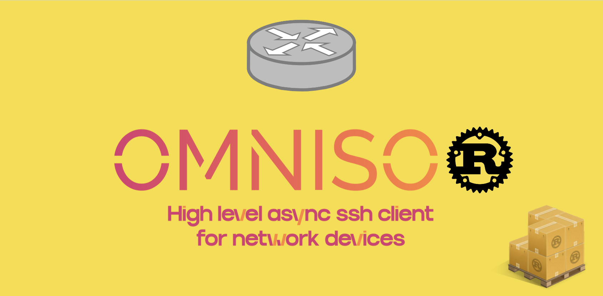

# Omnisor

Omnisor is an asynchronous high-level SSH client library for Rust, with specialized support for network devices.

Built on top of [async-ssh2-tokio]( https://github.com/Miyoshi-Ryota/async-ssh2-tokio) & [russh](https://github.com/warp-tech/russh)

## Features

* **Standard SSH Client** - Connect, authenticate, and execute commands on network devices.
* **Network Device Sessions** - Interactive PTY sessions for routers, switches, and firewalls
* **Vendor Presets** - Built-in support for Cisco, Juniper and more soon enough
* **Legacy Device Support** - Configurable SSH algorithms for older network equipment


## Install

```toml
[dependencies]
tokio = "1"
omnisor = "0.1"
```

## Quick Start - Standard SSH

For simple command execution on Linux/Unix servers, just use https://github.com/Miyoshi-Ryota/async-ssh2-tokio, since omnisor is forked from async-ssh2-tokio.


## Quick Start - Network Devices

For interactive sessions with network devices (routers, switches, firewalls):

```rust
use omnisor::{DeviceSession, CiscoVariant};

#[tokio::main]
async fn main() -> Result<(), omnisor::Error> {
    let mut session = DeviceSession::connect(
        ("192.168.1.1", 22),
        "admin",
        "password",
        CiscoVariant::Ios,
    ).await?;

    let result = session.send_command("show version").await?;
    println!("{}", result.output);

    let result = session.send_command("show ip route").await?;
    println!("{}", result.output);

    session.close().await?;
    Ok(())
}
```

## Device Session Builder

For more control over device connections:

```rust
use omnisor::{DeviceSession, CiscoVariant, AuthMethod};
use std::time::Duration;

#[tokio::main]
async fn main() -> Result<(), omnisor::Error> {
    let mut session = DeviceSession::builder()
        .address("192.168.1.1")
        .port(22)
        .username("admin")
        .auth(AuthMethod::with_key_file("~/.ssh/id_rsa", None))
        .vendor(CiscoVariant::NxOs)
        .command_timeout(Duration::from_secs(60))
        .connect()
        .await?;

    let result = session.send_command("show version").await?;
    println!("{}", result.output);

    session.close().await?;
    Ok(())
}
```

## Legacy Device Support

For older devices requiring legacy SSH algorithms (e.g., older Cisco IOS):

```rust
use omnisor::{DeviceSession, CiscoVariant};

#[tokio::main]
async fn main() -> Result<(), omnisor::Error> {
    // Use the IosLegacy variant for older Cisco devices
    let mut session = DeviceSession::connect(
        ("192.168.1.1", 22),
        "admin",
        "password",
        CiscoVariant::IosLegacy,
    ).await?;

    let result = session.send_command("show version").await?;
    println!("{}", result.output);

    session.close().await?;
    Ok(())
}
```

### Custom SSH Algorithms

For control over SSH algorithms you can specify whatever you like that is supported under https://github.com/Eugeny/russh

```rust
use omnisor::{DeviceSession, CiscoVariant, SshAlgorithms, kex, cipher, mac};

#[tokio::main]
async fn main() -> Result<(), omnisor::Error> {
    let mut session = DeviceSession::builder()
        .address("192.168.1.1")
        .username("admin")
        .password("password")
        .vendor(CiscoVariant::Ios)
        .ssh_algorithms(
            SshAlgorithms::new()
                .kex(vec![kex::DH_G14_SHA1, kex::DH_G1_SHA1])
                .cipher(vec![cipher::AES_256_CBC, cipher::AES_128_CBC])
                .mac(vec![mac::HMAC_SHA1])
        )
        .connect()
        .await?;

    let result = session.send_command("show version").await?;
    println!("{}", result.output);

    session.close().await?;
    Ok(())
}
```

## Supported Vendors

| Vendor  | Variants                                                |
|---------|---------------------------------------------------------|
| Cisco   | `Ios`, `IosXe`, `IosXr`, `NxOs`, `Asa`, `Wlc`, `IosLegacy` |
| Juniper | `Junos`, `ScreenOs`                                     |
| Linux   | `Linux` (generic)                                       |
